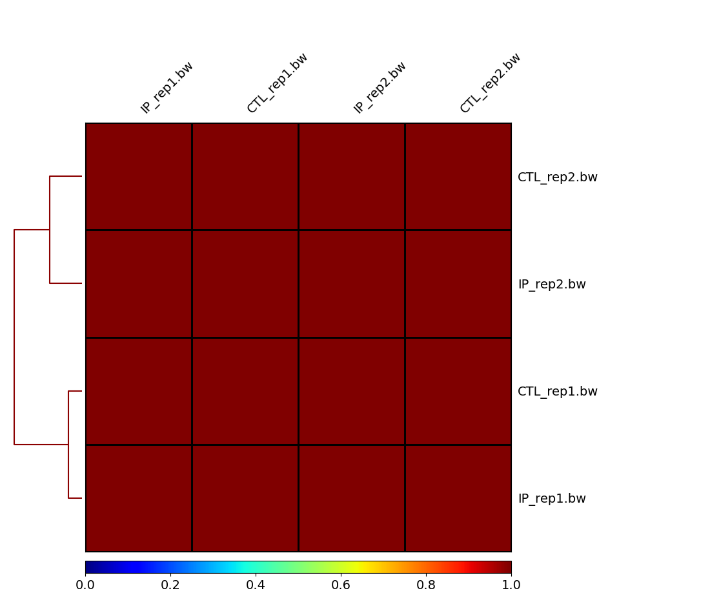
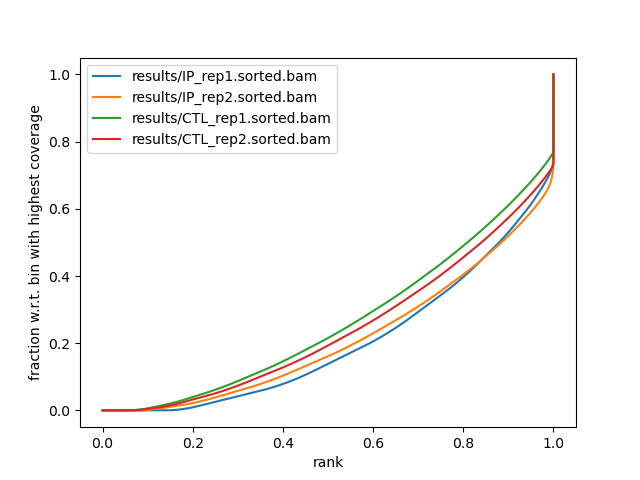

```{r setup, include=FALSE}
knitr::opts_chunk$set(echo = TRUE)
```

## 1
#### a
The only concerning aspect of the quality control of the sequencing reads is the sequence per tile quality in both the IP samples. However, after trimming using trimmomatic I believe that most of the problems with the per tile sequencing will be aleviated. There are a few other warnings on per sequence GC content and per base N content, but these are small errors that I do not expect to hinder downstream analysis.

#### b
For quality control related to alignment, I looked at the multiqc and samtools flagstats files I generated. I don't see anything concerning with the alignment. All the reads passed QC and have normal sequence duplication (less than 20%)and mapping levels with about 95% and up mapped. 

#### c
I don't think I will exclude any sample from further analysis, because the sequence per tile quality will be addressed by trimmomatic.


## 2 

The heatmap and fingerprint plots both convey the same conclusion; the samples both control and IP over both replicates are very similar to one another. Using the IGV genome browser, I uploaded the sample bigwig files to visualize what was happening here. It appears the samples are nearly identical in terms of the genomic regions they cover.   


```{r, correlation heatmap from plotCorrelation, echo=FALSE}

```

```{r, fingerprint plot, echo=FALSE}

```

```{r, IGV Whole Genome, echo=FALSE}
knitr::include_graphics("IGV BW Visualization Whole Genome.png")
```

```{r, IGV CHR 5, echo=FALSE}
knitr::include_graphics("IGV BW Visualization CHR 5.png")
```


## 3 

#### a 
Peaks present in each replicate:
Rep 1: 19139
Rep 2: 42162

#### b
Peaks present in reproducible peaks: 1879
The strategy I used to determine the reproducible peaks was to use bedtools intersect and include peaks that had at least 50% overlap between the rep 1 and 2 peaks. 

#### c 
After filtering peaks from the blacklist region, the number of remaining peaks was 1839.

```{r, peak_data, echo=FALSE}
peak_data <- data.frame(
  Rep1_Peaks = (19139),
  Rep2_Peaks = (42162),
  Reproducible_Peaks = (1879),
  Filtered_Peaks = (1839)
)
show(peak_data)
```


## 4 

#### a
Motif analysis results:
Motif analysis showed the highest ranking motifs as being matches to the following genes: MyoG, Myf5, Tcf12, MyoD. Almost all of these are involved in muscle regeneration in mus musculus. For example: MyoG or myogenin codes for a transcription factor that is involved in muscle adaptation along with skeletal muscle fiber development. Myf5 or myogenic factor 5 is involved in muscle differentiation during development and is expressed in skeletal musculature. Tcf12 is involved in mesoderm differentiation which includes skeletal muscles. MyoD is involved in myotube differentiation and skeletal muscle fiber adaptation.
All this implies that the factor of interest helps to express genes related to muscle regeneration. 

#### b
Gene enrichment results:
I used GO biological process component of PantherDB to perform gene enrichment analysis. The enrichment analysis showed similar results to that of the motif analysis. Within the 10 highest ranked GO terms were: positive regulation of cardiac muscle adaptation and 	
regulation of smooth muscle cell-matrix adhesion. These results seem to imply something similar to the motif results in that our IP samples help express genes related to muscles and their adaption/genesis. 

